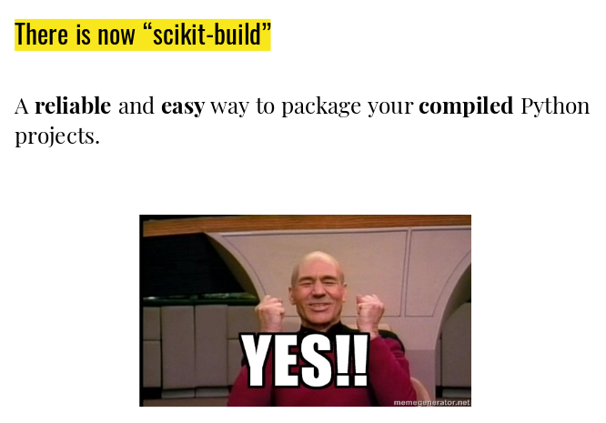

scikit-build
============

**scikit-build** is an improved build system generator for CPython C/C++/Fortran/Cython
extensions. It provides better support for additional compilers, build
systems, cross compilation, and locating dependencies and their associated
build requirements.

The **scikit-build** package is fundamentally just glue between
the `setuptools` Python module and [CMake](https://cmake.org/).

To get started, see http://scikit-build.readthedocs.io.

## scikit-build talk

This talk was presented at SciPy 2018 conference.

* slides: https://bit.ly/scikit-build-talk
* pdf: [scipy_2018_scikit-build_talk.pdf](scipy_2018_scikit-build_talk.pdf)
* video: https://www.youtube.com/watch?v=QVkg-cC5oe4

_For reference, all SciPy 2018 talks are available [here](https://github.com/deniederhut/Slides-SciPyConf-2018)_

## Licensing

All Works of Art in this repository are licensed under the Creative Commons Attribution Share Alike 4.0 International. See [LICENSE_CC_BY_SA_40](LICENSE_CC_BY_SA_40.md) file for details.

## SciPy 2018 submission details

### Authors

* Jean-Christophe Fillion-Robin1 ([@jcfr](https://github.com/jcfr))
* Matthew McCormick1 ([@thewtex](https://github.com/thewtex))
* Omar Padron1 ([@opadron](https://github.com/opadron))
* Max Smolens1 ([@msmolens](https://github.com/msmolens))
* Michael Grauer1 ([@mgrauer](https://github.com/mgrauer))
* Michael Sarahan2 ([@msarahan](https://github.com/msarahan))

1Kitware, Inc.
2Anaconda, Inc.

### Title

Scikit-build: A build system generator for CPython C/C++/Fortran/Cython extensions.

### Short description:

We present “Scikit-build”, an improved build system generator for CPython C/C++/Fortran/Cython extensions. It provides improved support for additional compilers, build systems, cross compilation, and locating dependencies and determining their build requirements over distutils/setuptools. We also describe how ITK and VTK C++ scientific libraries were updated to make use of scikit-build to ultimately be published as wheels.

### Keywords

* Build Tool
* CPython Extension
* Building
* Packaging
* Wheels
* Cross Platform

### Topics

* General
* Infrastructure

### Long description

Although the scientific packages NumPy, SciPy, SymEngine and Matplotlib can be used from Python today, since they bundle C, C++, Fortran or Cython extensions, successfully building the associated binary wheels is complex and prone to errors. This is a significant barrier to allow use of these packages on a broader set of platforms such as mobile, Raspberry Pi or HPC.

We present [scikit-build](https://pypi.org/project/scikit-build/), an improved build system generator for CPython C/C++/Fortran/Cython extensions that provides first-class support for additional compilers, build systems, cross compilation, and locating dependencies and their associated build requirements. The scikit-build package is fundamentally glue between the setuptools and [cmake](https://pypi.org/project/cmake/) Python packages that is used to facilitate the build process.

Initially developed during the SciPy sprints 2014, and later funded by the National Library Medicine in 2015, the scikit-build package is tested ([90% coverage](https://codecov.io/gh/scikit-build/scikit-build)) and available on [PyPI](https://pypi.org/project/scikit-build/) and [conda-forge](https://anaconda.org/conda-forge/scikit-build). It is also supported by core members of the Python Packaging Authority (PPA). In the future, the project aims to be a build tool option in the build system specification [PEP-518](https://www.python.org/dev/peps/pep-0518/).

In this talk, we will provide an overview of scikit-build, explain how it can be used to build simple CPython C, C++, Fortran and Cython extensions, and also describe how the build system of more complex C++ packages like the Visualization ToolKit (VTK) and the Insight Segmentation and Registration Toolkit (ITK) were updated to support generating wheels for multiple operating systems and python versions.

### Related links

* http://scikit-build.org/
* https://github.com/scikit-build/scikit-build

